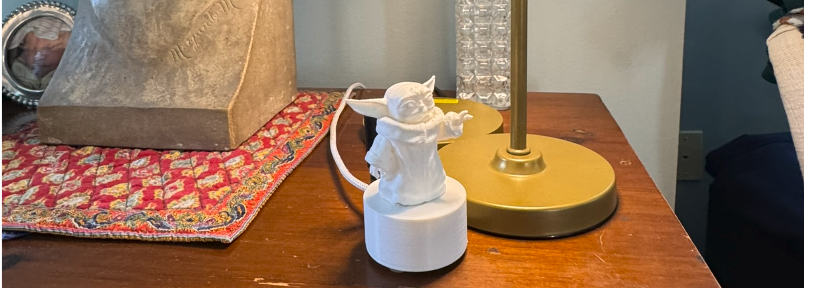

# Enclosure

*Ratar's printed enclosure: a parametric OpenSCAD (BOSL2) design*

A 50mm-diameter cylindrical two-part enclosure (base + lid) for the RF-HAT
board, sized to hold both the XIAO ESP32-C6 + CC1101 stack and a second,
wider board tier above it. Yoda is optional.

## Design highlights

- **Two-tier cavity**: a board cavity sized to the PCB, with a wider cutout
  starting partway up that continues through the top of the base — room for
  a second, larger board or extra component clearance above the main stack.
- **Antenna and USB-C cutouts**: both the round cable hole and the
  USB-C slot on the outer wall are cut as a small through-bore plus a wider,
  shallow counterbore pocket with a controlled flat shoulder between them —
  the trick that lets a flat connector face sit cleanly on an otherwise
  curved wall.
- **Bolted lid**: two M2 socket-head (Allen) bolts thread into heat-set
  brass inserts in the body, rather than a snap-fit or press-fit-only lid.
- **Fully parametric**: every dimension — board size, wall thickness, hole
  positions/sizes, bolt spacing, standoff heights — is a named variable at
  the top of the `.scad` file. Re-render after changing any of them.

## Print notes

Base and lid both print flat on the bed as oriented in the file (open
side / lid facing up); no supports needed.

## Files

- `ratar.scad` — the parametric source. Requires the
  [BOSL2](https://github.com/BelfrySCAD/BOSL2) OpenSCAD library
  (`include <BOSL2/std.scad>`, `include <BOSL2/screws.scad>`).
- `ratar.stl`.  Exported mesh, ready to slice.

To regenerate the STL after editing the source:

```sh
openscad -o ratar.stl ratar.scad
```
